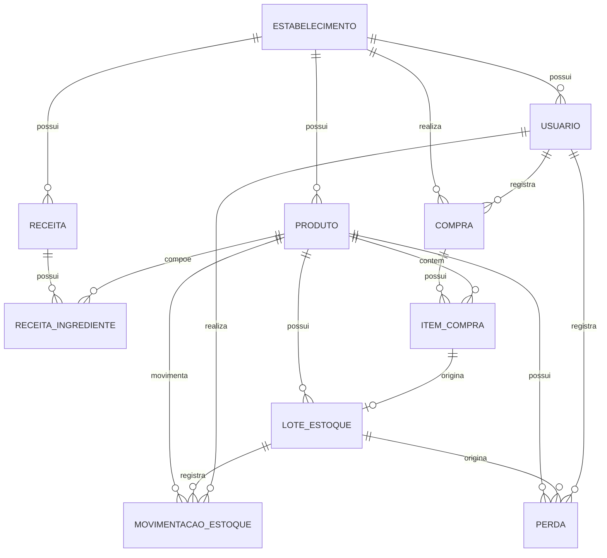

# PratoCerto

## 1. Objetivo

O PratoCerto é um sistema de gestão inteligente de estoque para restaurantes, lanchonetes, padarias e outros estabelecimentos de alimentação. O sistema busca reduzir o desperdício de alimentos e gastos desnecessários por meio de controle de estoque, validade, perdas, consumo, compras e análises.

A plataforma terá uma interface de gestão para computador e uma interface simplificada e responsiva para celular, compartilhando os mesmos dados. O objetivo é que o funcionário registre o mínimo possível e que o sistema automatize cálculos, alertas e análises, mantendo o gerente responsável pelas decisões.

## 2. Usuários

- **Gerente/Administrador:** cadastra produtos, receitas e configurações; acompanha estoque; consulta perdas; visualiza relatórios; gerencia usuários; acompanha custos; utiliza a IA; revisa e confirma entradas.
- **Funcionário:** consulta produtos permitidos; registra entradas, perdas e consumos; utiliza o modo rápido pelo celular; pode fotografar uma nota fiscal para iniciar o lançamento de uma compra.
- **Sistema/IA:** camada de automação e assistência. Processa os dados existentes, gera alertas, análises e recomendações e não substitui a decisão do gerente.

## 3. Casos de uso principais

- **UC01:** Gerente cria a conta e acessa o sistema.
- **UC02:** Gerente cadastra produtos e define unidade, estoque mínimo e estoque ideal.
- **UC03:** Funcionário registra uma entrada de estoque manualmente.
- **UC04:** Funcionário fotografa uma nota fiscal e confere os itens identificados antes de confirmar a entrada.
- **UC05:** Funcionário registra uma perda informando produto, quantidade e motivo.
- **UC06:** Usuário registra consumo de ingredientes ou produtos.
- **UC07:** Gerente cadastra uma receita relacionando prato e ingredientes.
- **UC08:** Sistema calcula baixa estimada de ingredientes a partir de consumo/venda e receita cadastrada, quando habilitado.
- **UC09:** Gerente consulta estoque atual e histórico de movimentações.
- **UC10:** Sistema alerta sobre produtos próximos do vencimento ou abaixo do estoque mínimo.
- **UC11:** Gerente consulta relatórios de desperdício, consumo, estoque e custos.
- **UC12:** Sistema gera sugestão de compras com base no estoque e histórico.
- **UC13:** Gerente pergunta à PratoCerto IA sobre os dados do estabelecimento.
- **UC14:** IA apresenta análises e recomendações baseadas nos dados disponíveis.
- **UC15:** Usuário consulta sugestões responsáveis de aproveitamento de alimentos.
- **UC16:** Gerente consulta possíveis organizações/iniciativas de doação quando houver fontes confiáveis.
- **UC17:** Gerente gerencia usuários e permissões.
- **UC18:** Usuário utiliza o sistema pelo celular ou computador com a mesma conta e os mesmos dados.

## 4. Requisitos funcionais

- **RF01:** Permitir cadastro e login de usuários.
- **RF02:** Possuir perfis de gerente/administrador e funcionário.
- **RF03:** Restringir funcionalidades conforme o perfil.
- **RF04:** Permitir cadastrar, editar, consultar e excluir/desativar produtos.
- **RF05:** Produto deve possuir nome, categoria, unidade de medida, estoque atual, estoque mínimo e estoque ideal.
- **RF06:** Registrar movimentações com tipo, produto, quantidade, data, usuário responsável e observação quando aplicável.
- **RF07:** Permitir entradas de estoque manuais.
- **RF08:** Permitir iniciar uma entrada por fotografia de nota fiscal.
- **RF09:** Tentar extrair da nota produtos, quantidades e valores por OCR/IA, quando tecnicamente disponível.
- **RF10:** Exigir conferência dos dados extraídos antes de atualizar o estoque.
- **RF11:** Permitir corrigir os dados extraídos antes da confirmação.
- **RF12:** Permitir relacionar item identificado na nota a produto já cadastrado.
- **RF13:** Permitir cadastrar produto novo quando um item não for reconhecido.
- **RF14:** Permitir registrar perdas informando produto, quantidade e motivo.
- **RF15:** Motivos de perda: vencimento, deterioração, sobra, preparo/acidente e outro.
- **RF16:** Ao confirmar uma perda, diminuir o estoque e criar o registro correspondente.
- **RF17:** Permitir registrar consumo.
- **RF18:** Permitir cadastrar receitas e ingredientes com quantidades.
- **RF19:** Calcular baixa estimada de ingredientes a partir de consumo/vendas e receitas quando habilitado.
- **RF20:** Permitir ajuste manual de estoque por usuário autorizado, registrando motivo e responsável.
- **RF21:** Mostrar produtos próximos do vencimento.
- **RF22:** Mostrar produtos abaixo do estoque mínimo.
- **RF23:** Apoiar o princípio FIFO (primeiro que entra, primeiro que sai), quando aplicável.
- **RF24:** Dashboard com indicadores resumidos de estoque, perdas, validade e custos.
- **RF25:** Gerar relatórios de desperdício por período, produto, categoria e motivo.
- **RF26:** Calcular valor financeiro estimado das perdas quando houver custo disponível.
- **RF27:** Permitir comparar períodos nos relatórios.
- **RF28:** Gerar sugestão de lista de compras considerando estoque, mínimo e histórico, quando houver dados suficientes.
- **RF29:** Permitir editar e confirmar a lista de compras antes de utilizá-la.
- **RF30:** Possuir o assistente PratoCerto IA.
- **RF31:** Permitir perguntas em linguagem natural sobre os dados disponíveis.
- **RF32:** Responder utilizando dados reais do sistema e informar quando não houver dados suficientes.
- **RF33:** Não inventar números, registros ou causas.
- **RF34:** Apresentar recomendações como apoio à decisão, sem executar ações críticas automaticamente.
- **RF35:** Possuir área de aproveitamento responsável de alimentos.
- **RF36:** Apresentar sugestões gerais de aproveitamento sem afirmar que determinado alimento é seguro para consumo.
- **RF37:** Apresentar informações sobre doação ou descarte adequado usando fontes confiáveis quando disponível.
- **RF38:** Possuir interface mobile simplificada para tarefas operacionais.
- **RF39:** Permitir no mobile registrar entrada, perda, consumo e consultar estoque com poucos toques.
- **RF40:** Permitir leitura de código de barras pelo celular quando implementado.
- **RF41:** Sincronizar alterações entre celular e computador.
- **RF42:** Permitir configurar preferências de alertas.
- **RF43:** Manter histórico/auditoria das alterações importantes.
- **RF44:** Possuir recursos de acessibilidade.
- **RF45:** Considerar contraste, tamanho de texto, teclado, leitores de tela quando viável, ícones com texto, redução de animações e interface simplificada.
- **RF46:** Permitir aprimorar acessibilidade durante testes com usuários.

### Escopo do MVP

1. Login e perfis.
2. Cadastro de produtos.
3. Consulta e movimentação de estoque.
4. Entradas e saídas.
5. Registro de desperdício.
6. Controle de validade.
7. Dashboard básico.
8. Histórico de movimentações.
9. Interface responsiva para celular.

OCR de nota fiscal, IA, código de barras, recomendações avançadas, doação, integração com vendas/PDV e previsão avançada entram depois do núcleo estar estável.

## 5. Requisitos não funcionais

- **RNF01 — Segurança:** senhas armazenadas com hash seguro, nunca em texto puro.
- **RNF02 — Segurança:** consultas ao banco com parâmetros/prepared statements.
- **RNF03 — Segurança:** formulários validados no servidor.
- **RNF04 — Segurança:** chaves, senhas e strings de conexão em variáveis de ambiente.
- **RNF05 — Autorização:** funcionário não pode acessar funções exclusivas do gerente alterando URL ou requisição.
- **RNF06 — Erros:** mensagens não devem expor SQL, stack traces, chaves ou detalhes internos.
- **RNF07 — Desempenho:** operações comuns devem responder rapidamente em condições normais.
- **RNF08 — Responsividade:** funcionar em computador e celular.
- **RNF09 — Usabilidade:** tarefas frequentes devem exigir poucos passos e campos.
- **RNF10 — Acessibilidade:** seguir boas práticas e não depender apenas de cores.
- **RNF11 — Confiabilidade:** ações críticas exigem confirmação e registram responsável.
- **RNF12 — Integridade:** movimentação confirmada atualiza estoque e histórico de forma consistente.
- **RNF13 — IA:** respeitar permissões do usuário.
- **RNF14 — IA:** deixar claro quando uma análise é estimativa ou quando faltam dados.
- **RNF15 — Privacidade:** tratar dados pessoais conforme a legislação aplicável, incluindo LGPD.
- **RNF16 — Deploy:** aplicação preparada para ambiente compatível com a stack escolhida.

## 6. Modelo de dados (DER simples)

### USUARIO
id_usuario (PK), nome, email, senha_hash, perfil, ativo, criado_em

### ESTABELECIMENTO
id_estabelecimento (PK), nome, tipo, criado_em

### PRODUTO
id_produto (PK), id_estabelecimento (FK), nome, categoria, unidade_medida, estoque_minimo, estoque_ideal, custo_referencia, ativo

### LOTE_ESTOQUE
id_lote (PK), id_produto (FK), quantidade_atual, data_entrada, data_validade, custo_unitario, id_movimentacao_entrada (FK)

### MOVIMENTACAO_ESTOQUE
id_movimentacao (PK), id_produto (FK), id_usuario (FK), tipo, quantidade, data_hora, motivo, observacao

### PERDA
id_perda (PK), id_produto (FK), id_usuario (FK), quantidade, motivo, valor_estimado, data_hora, observacao

### RECEITA
id_receita (PK), id_estabelecimento (FK), nome_prato, ativo

### RECEITA_INGREDIENTE
id_receita (FK), id_produto (FK), quantidade, unidade_medida

### COMPRA
id_compra (PK), id_estabelecimento (FK), id_usuario (FK), data_compra, fornecedor, valor_total, origem, imagem_nota

### ITEM_COMPRA
id_item_compra (PK), id_compra (FK), id_produto (FK), quantidade, valor_unitario, data_validade

### Relacionamentos

- ESTABELECIMENTO 1:N USUARIO
- ESTABELECIMENTO 1:N PRODUTO
- PRODUTO 1:N LOTE_ESTOQUE
- PRODUTO 1:N MOVIMENTACAO_ESTOQUE
- USUARIO 1:N MOVIMENTACAO_ESTOQUE
- PRODUTO 1:N PERDA
- USUARIO 1:N PERDA
- ESTABELECIMENTO 1:N RECEITA
- RECEITA N:N PRODUTO via RECEITA_INGREDIENTE
- ESTABELECIMENTO 1:N COMPRA
- COMPRA N:N PRODUTO via ITEM_COMPRA

## 7. Critérios de aceite

- **CA01:** Dado que um usuário não possui conta, quando preencher cadastro válido, então a conta deve ser criada e permitir login.
- **CA02:** Dado que o usuário é funcionário, quando acessar função exclusiva do gerente, então o acesso deve ser negado.
- **CA03:** Dado que o gerente cadastrou um produto, quando consultar estoque, então o produto deve aparecer corretamente.
- **CA04:** Dado que há 10 kg de tomate, quando registrar entrada de 5 kg e confirmar, então o estoque deve passar para 15 kg e o movimento ser registrado.
- **CA05:** Dado que há 10 kg de tomate, quando registrar perda de 2 kg, então o estoque deve passar para 8 kg e a perda aparecer no histórico.
- **CA06:** Dado que existe custo do produto, quando ocorrer perda, então o sistema deve calcular o valor estimado.
- **CA07:** Dado que um produto está próximo do vencimento, quando abrir o dashboard, então deve aparecer alerta conforme configuração.
- **CA08:** Dado que um produto está abaixo do mínimo, quando abrir o dashboard, então deve ser sinalizada a reposição.
- **CA09:** Dado que uma nota possui itens reconhecíveis, quando fotografá-la, então os dados extraídos devem aparecer para conferência antes da entrada.
- **CA10:** Dado que o OCR identificou algo errado, quando o usuário corrigir antes da confirmação, então o sistema deve usar o dado corrigido.
- **CA11:** Dado que uma entrada por nota foi confirmada, quando o lançamento terminar, então os itens confirmados devem aparecer no estoque e histórico.
- **CA12:** Dado que existem receitas, quando registrar consumo e a baixa automática estiver habilitada, então os ingredientes devem ser baixados conforme a receita.
- **CA13:** Dado que existem perdas, quando filtrar relatório por período, então devem aparecer os registros correspondentes.
- **CA14:** Dado que existem dados suficientes, quando o gerente perguntar à IA sobre desperdício, então a resposta deve usar esses dados.
- **CA15:** Dado que não existem dados suficientes, quando o gerente perguntar à IA, então ela deve informar essa limitação.
- **CA16:** Dado que o funcionário registre perda pelo celular, quando confirmar, então a alteração deve aparecer também no computador.
- **CA17:** Dado que o usuário está no celular, quando registrar uma perda, então deve concluir sem precisar abrir o desktop.
- **CA18:** Dado que o gerente ajuste o estoque, quando confirmar, então devem ser registrados quantidade, usuário, data e motivo.
- **CA19:** Dado que o usuário tente excluir informação crítica, quando iniciar a exclusão, então deve ser solicitada confirmação.
- **CA20:** Dado que um recurso de acessibilidade esteja habilitado, quando o usuário alterar tamanho do texto ou navegar por teclado, então a interface deve continuar utilizável.

## 8. Decisão de stack e deploy

### Stack proposta

- **Frontend/backend:** Next.js + TypeScript.
- **Banco:** PostgreSQL.
- **Acesso a dados:** ORM ou biblioteca compatível com PostgreSQL usando consultas parametrizadas.
- **Autenticação:** solução segura compatível com a aplicação.
- **Interface:** web responsiva, com foco em acessibilidade e uso mobile.
- **OCR/IA:** integração posterior com serviços apropriados, usando variáveis de ambiente para credenciais.

### Deploy

- **Aplicação:** Vercel.
- **Banco:** PostgreSQL compatível com Vercel, como Neon ou equivalente.
- **Versionamento:** Git + GitHub.

### Justificativa

A stack deve considerar desde o início o destino do deploy. A aplicação será uma plataforma web responsiva, permitindo usar a mesma solução no computador e no celular. O projeto deve ser desenvolvido a partir desta spec, com tarefas pequenas, revisão do plano/Artifact e diff, testes locais e testes manuais contra os critérios de aceite.

### Ordem de implementação

1. Estrutura do projeto e banco.
2. Login e autorização.
3. Cadastro de produtos.
4. Fluxo completo de entrada/saída e consulta de estoque.
5. Registro de perdas.
6. Validade e alertas.
7. Dashboard.
8. Interface mobile.
9. Entrada por foto de nota fiscal.
10. Receitas e baixa semiautomática.
11. Relatórios avançados.
12. Lista de compras.
13. PratoCerto IA.
14. Aproveitamento/doação.
15. Código de barras e integrações futuras.

## Diretrizes finais

O PratoCerto deve ser ambicioso na visão, mas viável na execução. Primeiro deve existir um núcleo pequeno e funcional que grave e consulte dados no banco. Depois, as funcionalidades avançadas devem ser adicionadas sem quebrar esse núcleo.

O funcionário deve registrar o mínimo possível. O sistema deve fazer o máximo possível de organização, cálculos, alertas e análises automaticamente.

A IA é uma ferramenta de apoio e não deve inventar informações nem tomar decisões críticas sozinha.

Acessibilidade é requisito do produto desde o início e deverá ser aprimorada por pesquisa e testes durante a construção.

A spec deve ser atualizada caso uma decisão importante altere o comportamento do sistema.

## Visão de dados

A visão de dados será organizada em três níveis:

- **Conceitual:** entidades, relacionamentos e cardinalidades do sistema.
- **Lógico:** tabelas, atributos, chaves primárias e chaves estrangeiras.
- **Físico:** implementação no PostgreSQL, incluindo tipos, restrições e índices.

### Entidades principais

- ESTABELECIMENTO
- USUARIO
- PRODUTO
- LOTE_ESTOQUE
- MOVIMENTACAO_ESTOQUE
- PERDA
- RECEITA
- RECEITA_INGREDIENTE
- COMPRA
- ITEM_COMPRA

### Relacionamentos principais

- ESTABELECIMENTO 1:N USUARIO
- ESTABELECIMENTO 1:N PRODUTO
- PRODUTO 1:N LOTE_ESTOQUE
- PRODUTO 1:N MOVIMENTACAO_ESTOQUE
- LOTE_ESTOQUE 1:N MOVIMENTACAO_ESTOQUE
- USUARIO 1:N MOVIMENTACAO_ESTOQUE
- PRODUTO 1:N PERDA
- LOTE_ESTOQUE 1:N PERDA
- ESTABELECIMENTO 1:N RECEITA
- RECEITA N:N PRODUTO por meio de RECEITA_INGREDIENTE
- ESTABELECIMENTO 1:N COMPRA
- COMPRA 1:N ITEM_COMPRA
- PRODUTO 1:N ITEM_COMPRA
- ITEM_COMPRA 1:0..1 LOTE_ESTOQUE

## Modelagem estrutural

A modelagem estrutural representa a organização estática do sistema, incluindo banco de dados, classes e componentes.

### Classes principais

- Estabelecimento
- Usuario
- Produto
- LoteEstoque
- MovimentacaoEstoque
- Perda
- Receita
- ReceitaIngrediente
- Compra
- ItemCompra

### Componentes principais

```text
Interface Web/Mobile
        ↓
Camada de Aplicação
        ↓
Regras de Negócio
        ↓
Acesso a Dados
        ↓
PostgreSQL
```

### Diagrama ER



## Modelagem comportamental

A modelagem comportamental representa como o sistema reage às ações dos usuários por meio de casos de uso e atividades.

### Atores

- Gerente/Administrador
- Funcionário
- Sistema
- Serviço de OCR/IA

### Principais casos de uso

- Acessar sistema;
- Gerenciar usuários;
- Gerenciar produtos;
- Gerenciar estoque;
- Registrar perdas;
- Registrar consumo;
- Gerenciar receitas;
- Registrar compras;
- Conferir nota fiscal;
- Confirmar compra;
- Consultar relatórios;
- Consultar alertas;
- Utilizar PratoCerto IA.

### Fluxo de atividade — compra por nota fiscal

```text
Fotografar nota
      ↓
OCR/IA interpreta
      ↓
Sistema apresenta os dados
      ↓
Usuário confere
      ↓
Corrigir ou vincular produtos, se necessário
      ↓
Confirmar compra
      ↓
Criar itens da compra
      ↓
Criar lotes
      ↓
Registrar movimentação de entrada
      ↓
Atualizar estoque
```

A confirmação do usuário é obrigatória antes da atualização definitiva do estoque.

## SRS — Especificação de Requisitos de Software

Este documento funciona como a especificação de requisitos do PratoCerto. Os requisitos funcionais, não funcionais, casos de uso, regras de negócio, critérios de aceitação e requisitos relacionados à interface estão descritos nas seções correspondentes deste documento.

### Escopo

O sistema abrangerá o controle de estoque, entradas, perdas, consumo, validade, compras, relatórios, acessibilidade, interface mobile e desktop e recursos de automação e IA conforme as fases de desenvolvimento.

### Requisitos de interface

- Interface web responsiva para computador e celular.
- Modo rápido para operações no celular.
- Ícones acompanhados de texto quando necessário.
- Contraste adequado e informações não dependentes somente de cores.
- Navegação por teclado quando aplicável.
- Compatibilidade com leitores de tela quando possível.

## Link do repositório

**GitHub:** https://github.com/Pedr0pymaker/PratoCerto
